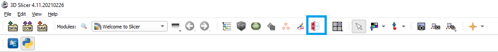
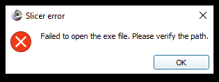
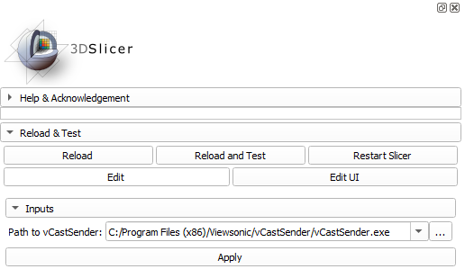
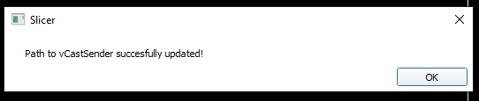
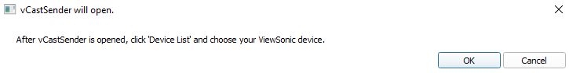
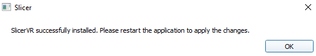

# MultiViews

This repository is part of a project focused on the visualization of 3D Slicer in multiple devices, including ViewSonic Boards, VR lenses and HoloLens. HoloLens connection hasn't been implemented yet. For the connection with VR lenses, SlicerVR is installed along this extension automatically, to save the user time on installing both. 

## ViewBoard connection
### Motivation
3D Slicer is a highly used application for the analysis and processing of medical imaging data. Recent efforts have focused on extending its usability from computers to other devices by the addition of features such as touchscreen and Virtual Reality (VR) capabilities. This project is intented to centralize the visualization of 3D Slicer in multiple devices in one extension, including VR lenses, touchscreen ViewSonic Boards and HoloLens; which is intented to easy the transitioning between the different modalities for the users. 

### Usage
This module works through the vCastSender app. It is required to install vCastSender app for this module to work.\
After installing the extension, an icon should appear in the top of the application, as shown in blue in the following image.

<p align="center"></p>

If you click on this icon without configuring the path to the vCastSender exe file, an error will pop up.

<p align="center"></p>

To configure the executable path, use the following steps:

1. Click on 'Module list' and select the vCastSlicer module under Multiviews.
2. Insert a valid path to the vCastSender executable file, usually located under ``` C:\Program Files (x86)\Viewsonic ```. You can also click on the three dots widget next to the input space and select the file directly from the file manager. 
3. The 'Apply' button will be disabled until a valid path is entered.

<p align="center"></p>

4. After inputing a valid path to the executable file, hit on 'Apply'. A new window will pop up indicating that the change was performed successfully.

<p align="center"></p>

5. Now, you should be able to click on the widget on the toolbar (top of the screen) and vCastSender should be opened.

<p align="center"></p>

6. Once vCastSender is open, click on 'Device List', select the board that you want to connect to, input the PIN code and hit on Cast. By this moment, you should be able to see 3D slicer in your Viewsonic device.

A few notes:
* If the executable changes its location or gets deleted, an error window will be displayed. 
* After the initial setup, the 'Apply' button will be disabled. If the executable location changed, just select the new file and the button should change its state to enabled.
* After installing this extension, it is not possible to uninstall SlicerVR without uninstalling this extension as well. If you uninstall SlicerVR, when Slicer reboots, it will automatically reinstall it. 

<p align="center"></p>
